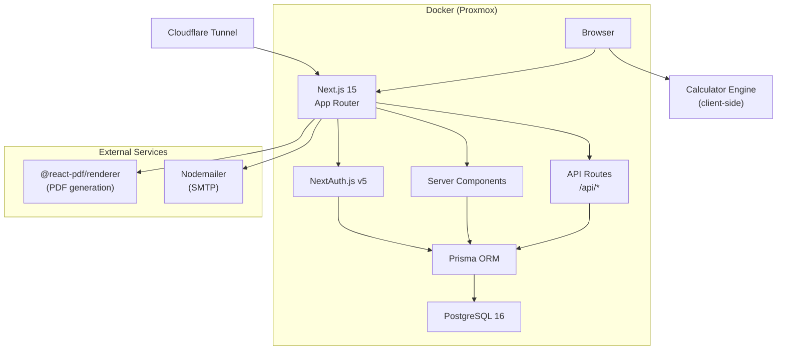

# Architecture Overview — Printforge Quote

## System Diagram



## Key Components

### Calculator Engine
- **Purpose:** Real-time 3D print cost calculation — the core feature
- **Location:** `src/lib/calculator.ts`
- **Dependencies:** None (pure functions, runs client-side)
- **Notes:** Must be instant — no network calls. Accepts typed input, returns cost breakdown.

### App Shell / Dashboard Layout
- **Purpose:** Sidebar navigation, dark mode, responsive layout
- **Location:** `src/app/(dashboard)/layout.tsx`
- **Dependencies:** shadcn/ui, next-themes

### Auth
- **Purpose:** Multi-tenant authentication (email/password for MVP)
- **Location:** `src/lib/auth.ts`, `src/app/api/auth/[...nextauth]/route.ts`
- **Dependencies:** NextAuth.js v5, Prisma adapter

### Database / ORM
- **Purpose:** Type-safe data access with multi-tenancy (user_id on all tables)
- **Location:** `prisma/schema.prisma`, `src/lib/prisma.ts`
- **Dependencies:** Prisma, PostgreSQL

### Quote PDF Generator
- **Purpose:** Generate branded PDF quotes from calculator results
- **Location:** `src/lib/pdf/` (Phase 3)
- **Dependencies:** @react-pdf/renderer

## Data Flow

```
User Input → Calculator Engine (client) → Cost Breakdown Display
                                        ↓
                                  Save as Preset → API → Prisma → PostgreSQL
                                        ↓
                              Create Quote → API → Prisma → PostgreSQL
                                        ↓
                                  Generate PDF → @react-pdf/renderer
                                        ↓
                                  Email Quote → Nodemailer → SMTP
```

## Multi-Tenancy

Every database table with user data includes a `userId` field. All queries must filter by the authenticated user's ID. This is enforced at the Prisma query level, not via database-level row security (simpler for MVP, can migrate later if needed).

## Environment Variables

| Variable | Purpose | Required |
|----------|---------|----------|
| `DATABASE_URL` | PostgreSQL connection string | Yes |
| `NEXTAUTH_URL` | App base URL | Yes |
| `NEXTAUTH_SECRET` | Auth encryption secret | Yes |
| `NEXT_PUBLIC_APP_NAME` | Display name | No |
| `NEXT_PUBLIC_APP_URL` | Public URL | No |

## Deployment

Docker Compose with two services:
- `app` — Next.js standalone build (Node 20 Alpine)
- `db` — PostgreSQL 16 Alpine

Exposed via Cloudflare Tunnel for public access. Runs on Daniel's Proxmox infrastructure.
